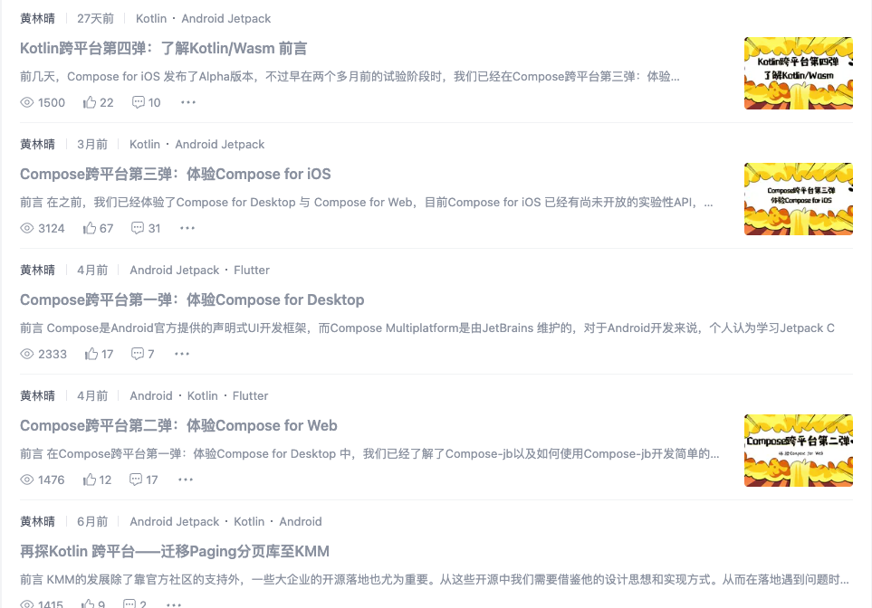
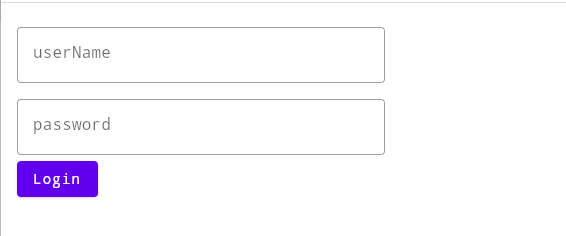

# Compose for Web for Wasm

这是一个Compose跨平台创建Web/Wasm项目的模板，在最新的IDEA中我们只能创建Kotlin/Wasm项目，如果想创建Compose for Web for Wasm的项目需要添加一些配置。你可以直接使用这个模板项目来开发自己的Web跨平台项目。

如果你还不了解Kotlin/Wasm是什么，可以阅读这篇文章：
[Kotlin跨平台第四弹：了解Kotlin/Wasm 前言](https://juejin.cn/post/7224718832786325559)

如果你对Compose跨平台感兴趣，可以阅读我的专栏：
[Compose跨平台专栏](https://juejin.cn/column/7224317849140428859)

我将持续更新Compose跨平台相关的内容



导入项目后，打开wasmMain目录下的Simple.kt文件，你将看到下列代码：

```
@OptIn(ExperimentalComposeUiApi::class)
fun main() {
    CanvasBasedWindow {
        //在这里可以调用任意Compose代码
        LoginUI()
    }
}
```

你可以在CanvasBasedWindow下编写任意的Compose函数，本事例中，在commonMain目录下编写了一个公用的登陆UI函数

```
@Composable
fun LoginUI() {

    var username by remember { mutableStateOf("") }
    var password by remember { mutableStateOf("") }

    Column(
        modifier = Modifier
            .width(400.dp)
            .padding(16.dp)
    ) {
        OutlinedTextField(
            value = username,
            onValueChange = { username = it },
            label = { Text("userName") },
            placeholder = { Text("input userName") },
            modifier = Modifier.fillMaxWidth()
        )

        OutlinedTextField(
            value = password,
            onValueChange = { password = it },
            label = { Text("password") },
            placeholder = { Text("input password") },
            visualTransformation = PasswordVisualTransformation(),
            modifier = Modifier
                .fillMaxWidth()
                .padding(top = 8.dp)
        )

        Button(onClick = {
            //login
        }) {
            Text("Login")
        }
    }

}
```

运行Web程序，结果如下图所示。




尽情享受吧！

如果你有任何疑问欢迎关注我的公众号“Android技术圈”，我们一起交流～

<br>

# License

```
/*
* Copyright (C)  HuangLinqing-, Compose_Wen_Wasm Open Source Project
*
* Licensed under the Apache License, Version 2.0 (the "License");
* you may not use this file except in compliance with the License.
* You may obtain a copy of the License at
*
*      http://www.apache.org/licenses/LICENSE-2.0
*
* Unless required by applicable law or agreed to in writing, software
* distributed under the License is distributed on an "AS IS" BASIS,
* WITHOUT WARRANTIES OR CONDITIONS OF ANY KIND, either express or implied.
* See the License for the specific language governing permissions and
* limitations under the License.
  */